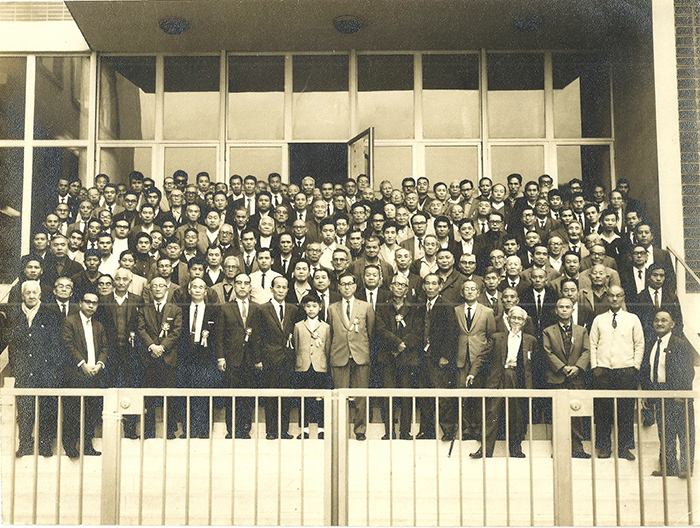

O Brasil Nippon Ki-in foi fundado em 19 de janeiro de 1989 pelo 9º dan
profissional Iwamoto Kaoru, então chamado de Nihon Ki-in da América do
Sul com o intuito de ser um centro na América do Sul para a divulgação
do Go.

Ao longo dos anos diversas atividades foram desenvolvidas no Ki-in como
os 1º, 2º e o 15º Torneio Iberoamericano de Go respectivamente em 1999,
2000 e 2013. Bem como recebeu a 1ª partida disputada pelo Kisei-sen em
12 e 13 de fevereiro 2008, entre os 9º dan profissionais Cho Chikun e
Yamashita Keigo.

O Brasil Nippon Ki-in organiza diversos eventos e atividades regulares,
mais notoriamente torneios, todo primeiro e terceiro domingo do mês e
anualmente a Copa do Brasil de Go (Campeonato Brasileiro de Go) que em
2018 terá sua 8ª edição realizada durante o feriado de 7 de setembro.

<figure>

<figcaption>
  Imwamoto Kaoru 9p &mdash; fundador do Brasil Nippon Ki-in
</figcaption>
</figure>

Imwamoto Kaoru (岩本薫 5 de fevereiro de 1902 – 29 de Novembro de 1999),
também conhecido como Honinbo Kunwa, foi jogador japonês profissional de
Go e atingiu o rank 9 dan. Nascido em Shimane, Japão, durante sua
infância passou vários anos em Busan, Coreia (1905-1913), onde estudou
Go com seu pai.

Ele retornou ao Japão para estudar Go, indo para Tokyo, tornando-se um
discípulo de Hirose Heijiro 6 dan de Hoensha em 1913. Ele atingiu o 1º
dan em 1917, e subiu rapidamente através do ranks. Em 1924, quando a
Nihon Ki-in foi estabelecida, Iwamoto alcançou o 6º dan.

Com dúvidas quanto ao seu futuro como jogador profissional de Go,
aposentou-se e imigrou para o Brasil como um agricultor de café em 1929.
No entanto, dois anos depois sua aventura agrícola se mostrou
infrutífera e ele retornou ao Japão e continuou sua carreira de Go, em
1931, mas não perdeu seu contato especial com o Brasil.

Em 1935 venceu o Oteai (o mais importante torneio no Japão até então).
Em 1945 Iwamoto desafiou o terceiro Honinbo jogado contra Hashimoto
Utaro. O segundo jogo dessa disputa pelo título, foi jogado na periferia
de Hiroshima, e é conhecido como o ‘Jogo da Bomba Atômica’. A disputa
pelo Honinbo foi interrompida por causa da guerra, mas após seu término
houve sua continuação, terminando empatada em 3-3. Um desempate no
sistema melhor de três aconteceu em 1946, quando Iwamoto ganhou dois
jogos seguidos conquistando o título de Honinbo. Ele então assumiu o
nome Honinbo Kunwa.

Após a guerra a casa de Iwamoto serviu como local provisório para a
Nihon Ki-in que teve a sua sede queimada por um bombardeamento de B29 em
1945 garantindo o seu funcionamento até que se encontrasse uma nova sede
para o Nihon Ki-in. Iwamoto defendeu o titulo Honinbo perante Kitani
Minoru em 1947, e em 1948 alcançou o 8º dan, tornando-se presidente da
Nihon Ki-in. Mais tarde, perdeu o título Honinbo para Hashimoto Utaro em
1950. Ele venceu o NHK Cup em 1955. Viajou extensivamente para levar os
ensinamentos do Go às pessoas. Ele gastou 18 meses entre 1961-1962 em
Nova York, difundindo os conhecimentos do Go. Ele alcançou o 9º dan em
1967, e teve muitos discípulos. Aposentou-se em Abril de 1983. Em seus
últimos anos, ele foi o principal benfeitor de vários centros europeus e
americanos de Go em Londres, São Paulo, Nova York, Seattle e Amsterdam,
em grande parte graças à criação da Fundação Iwamoto, em 1986.

É autor de três livros em inglês: “Go for Beginners”, “Keshi and
Uchikomi” e “The 1971 Honinbo Tournament”. Nas suas últimas três décadas
de vida, atravessou o mundo ajudando a internacionalizar o jogo. Com a
construção de um centro permanente de Go nas Américas, ele realizou uma
de suas mais antigas ambições. Sua visão tomou forma com a construção do
prédio da sede do Nihon Kiin em São Paulo. Para Iwamoto, a escolha do
Brasil como local do primeiro de uma série de centros internacionais de
Go, teve um significado especial devido à sua migração para o Brasil em
1929.
